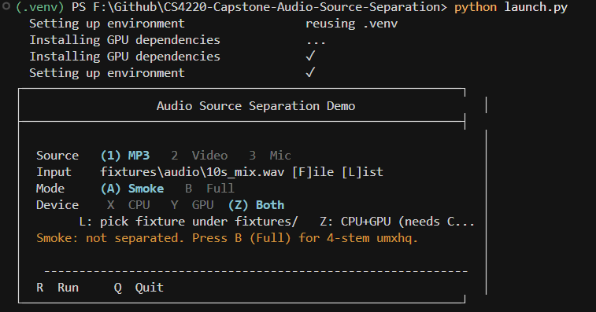
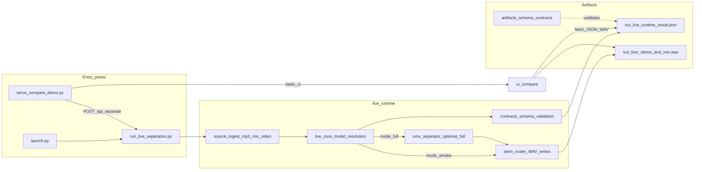
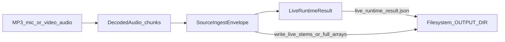

# CS4220 Capstone — Audio Source Separation Harness

Reproducible evaluation, benchmarking, and **contract-first live runtime** tooling for audio source separation (Open-Unmix / Demucs telemetry paths). The repo validates ONNX export → optional TensorRT, runs **live separation** from MP3, microphone, or video audio with JSON + WAV artifacts, and ships a **browser compare UI** for inspection and CPU/GPU A/B listens.

---

## Highlights

| Area | Entry point | Output |
|------|-------------|--------|
| Interactive runs | [`launch.py`](launch.py) | `artifacts/live/...` + opens compare UI URLs |
| Live CLI | [`scripts/live/run_live_separation.py`](scripts/live/run_live_separation.py) | `live_runtime_result.json`, four stems, **`mix.wav`** (on success) |
| Compare UI | [`scripts/ui/serve_compare_demo.py`](scripts/ui/serve_compare_demo.py) | `http://127.0.0.1:8000/ui/compare/` (+ optional `POST /api/separate`) |
| Contracts | [`live_runtime/contracts.py`](live_runtime/contracts.py), [`artifacts/schema/live_runtime_result.schema.json`](artifacts/schema/live_runtime_result.schema.json) | Schema-validated JSON |

**Artifacts policy:** Generated runs under `artifacts/live/`, `artifacts/bench/`, etc. are normally **local only** — they are not required in git (JSON schemas under `artifacts/schema/` are versioned).

---

## Documentation map

| Topic | Doc |
|-------|-----|
| Index | [`docs/README.md`](docs/README.md) |
| Architecture diagrams | [`docs/architecture/README.md`](docs/architecture/README.md) |
| `live_runtime` API | [`docs/api/README.md`](docs/api/README.md) |
| Scripts & verifiers | [`docs/scripts/README.md`](docs/scripts/README.md) |
| Compare UI | [`docs/ui/README.md`](docs/ui/README.md) |
| Tests | [`docs/tests/README.md`](docs/tests/README.md) |
| Operations | [`docs/ops/RUNBOOK.md`](docs/ops/RUNBOOK.md) |
| Config / schemas | [`docs/config/README.md`](docs/config/README.md) |
| Reproducibility | [`configs/environment.lock.md`](configs/environment.lock.md) |
| Course materials | [`docs/reports/CAPSTONE_PROGRESS_REPORT.md`](docs/reports/CAPSTONE_PROGRESS_REPORT.md), [`docs/reports/CS4220_FINAL_PROJECT_PROPOSAL.pdf`](docs/reports/CS4220_FINAL_PROJECT_PROPOSAL.pdf) |
| Archived agent plans | [`docs/archive/README.md`](docs/archive/README.md) |

 Maintainer / AI onboarding: [`CLAUDE.md`](CLAUDE.md).

---

## Repository layout

```
live_runtime/          # Contracts, ingest, model-path resolution, stem routing, optional UMX full separation
scripts/               # eval, export, benchmark, live CLI, UI server, verify
tests/                  # pytest + Playwright UI tests
ui/compare/             # Canonical vanilla-JS compare + upload shell
ui/demo/                # Redirects to /ui/compare/
artifacts/schema/       # JSON Schema contracts (tracked)
fixtures/audio|video/   # Deterministic smoke media (tracked)
configs/               # environment.lock.md — reproducibility pinboard
docs/                   # Structured reference + reports + archived plans
```

---

## Quick start

**Python:** `>=3.10,<3.15` (see [`pyproject.toml`](pyproject.toml)).

```bash
python -m venv .venv
# Windows:
.venv\Scripts\activate
# Linux/macOS:
# source .venv/bin/activate

pip install -e ".[dev]"
```

Optional extras:

- **Mic:** `pip install -e ".[mic]"` (PortAudio-backed capture)
- **GPU compare / launcher full mode:** `pip install -e ".[gpu]"` or follow CUDA wheel flow in [`launch.py`](launch.py) / [`CLAUDE.md`](CLAUDE.md)

**Smoke fixtures** live at `fixtures/audio/demo_mix.mp3` and `fixtures/video/demo_mix.mp4`.

Place weights for launcher **Full** gating / comparisons at `artifacts/models/umx-live.pt` if needed (`scripts/models/bootstrap_umx_live_checkpoint.py` documents how pretrained `umxhq` relates to this path).

### Interactive launcher (`launch.py`)

After install, start the **Audio Source Separation Demo** TUI from the repo root (with `.venv` activated):

```bash
python launch.py
```

The launcher can bootstrap or reuse `.venv`, install GPU launcher extras when needed, run live separation, and open the compare UI with the right `?artifact=` URLs.



| Keys | Action |
|------|--------|
| **1 / 2 / 3** | Source: **MP3**, **Video**, or **Mic** |
| **F / L** | Pick **file** or **list** a fixture under `fixtures/` |
| **A / B** | **Smoke** (fast pipeline check; not full four-stem separation) or **Full** (**Open-Unmix `umxhq`**, four stems — needs weights / GPU stack as configured) |
| **X / Y / Z** | **CPU**, **GPU**, or **Both** (compare — **Y/Z** need CUDA PyTorch; see dashboard probe line if greyed out) |
| **R** | **Run** — writes under `artifacts/live/…` and opens the browser when configured |
| **Q** | **Quit** |

Use **B (Full)** when you want real separated stems; **A (Smoke)** is for contract timing without running full `umxhq`. **Z (Both)** runs CPU then GPU into sibling output dirs and opens a dual-artifact compare when available.

---

## High-level system architecture



---

## Live runtime data flow



- **Smoke** (`--mode smoke`): deterministic pipeline exercise — vocals PCM, other stems silence unless full separation runs.
- **Full** (`--mode full`): Open-Unmix **`umxhq` with `pretrained=True`** via [`live_runtime/umx_separator.py`](live_runtime/umx_separator.py) when torch/openunmix are installed; emits real four-stem WAVs via `write_live_stems_from_arrays`.

**Model path resolution** ([`live_core.resolve_live_model_path`](live_runtime/live_core.py)): only **`artifacts/models/umx-live.pt`** and **`artifacts/models/demucs-live.pt`** are “supported” telemetry paths; anything else falls back to the default **UMX** path for **`fallback_applied` / verifier contracts**. The live CLI’s **full** separation path still loads **UMX pretrained** weights — Demucs `.pt` is not separate inference glue in this slice.

---

## Compare UI quick start

```bash
python scripts/ui/serve_compare_demo.py
# Open printed URL — typically ends in /ui/compare/
```

Launcher (`python launch.py`) can open URLs with **`?artifact=`**, optional **`artifact2`** (dual CPU/GPU stem waveforms), and **`benchmark=`** when a capstone manifest exists. **`/ui/demo/`** redirects to **`/ui/compare/`**.

Deep reference: [`docs/ui/README.md`](docs/ui/README.md).

---

## Verification

**Automated:**

```bash
pytest
python -m playwright install chromium   # once, for UI tests
```

Slice verifiers (bash):

```bash
bash scripts/verify/s01_check.sh       # ONNX export + schema
bash scripts/verify/s02_check.sh       # Live MP3 → stems + JSON
bash scripts/verify/m002_s01_check.sh # Demucs *path / fallback* contracts
bash scripts/verify/s06_check.sh       # Capstone evidence bundle
```

Successful live runs emit under `artifacts/live/<run>/`:

- `live_runtime_result.json`
- `vocals.wav`, `drums.wav`, `bass.wav`, `other.wav`
- **`mix.wav`** — decoded mono PCM for the Input lane when `input` is not already a WAV path

---

## Local / CI-safe ONNX + TRT dry-run

```bash
python scripts/export/export_umx_onnx.py \
  --onnx-output artifacts/export/umx-smoke.onnx \
  --input-shape 1,2,44100 \
  --min-shape 1,2,22050 \
  --opt-shape 1,2,44100 \
  --max-shape 1,2,88200 \
  --dry-run

bash scripts/export/build_trt_engine.sh \
  --onnx artifacts/export/umx-smoke.onnx \
  --engine artifacts/bench/trt/umx-smoke.engine \
  --min-shape 1x2x22050 --opt-shape 1x2x44100 --max-shape 1x2x88200 \
  --dry-run
```

---

## GPU TensorRT build (optional)

When `trtexec` is installed:

```bash
bash scripts/export/build_trt_engine.sh \
  --onnx artifacts/export/umx-smoke.onnx \
  --engine artifacts/bench/trt/umx-smoke.engine \
  --min-shape 1x2x22050 \
  --opt-shape 1x2x44100 \
  --max-shape 1x2x88200 \
  --fp16 \
  --timeout-s 600
```

---

## License

This project is released under the [MIT License](LICENSE).
