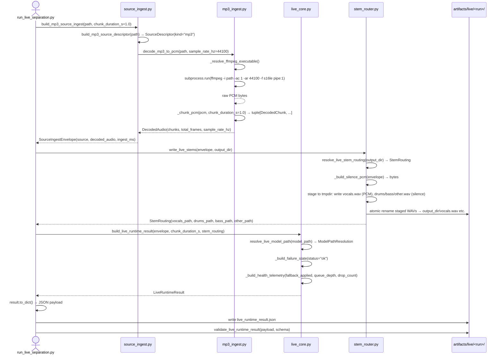
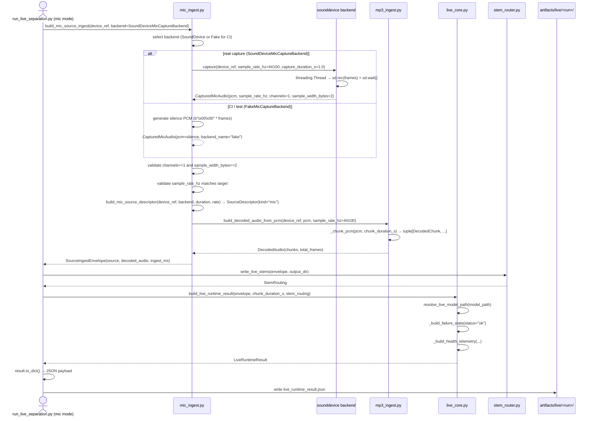
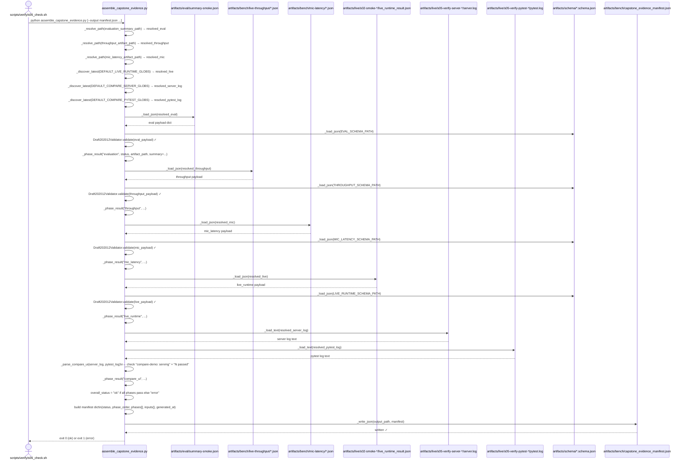

# Architecture Diagrams

This document contains UML and interaction diagrams for the CS4220 Audio Source Separation capstone project.
The diagrams cover the `live_runtime` data model, component boundaries, and the three primary runtime flows.

---

## 1. Class Diagram — `live_runtime` Dataclasses

All frozen dataclasses defined across `live_runtime/contracts.py`, `live_runtime/mp3_ingest.py`,
`live_runtime/mic_ingest.py`, `live_runtime/source_ingest.py`, `live_runtime/stem_router.py`,
and `live_runtime/live_core.py`. Relationships show composition (solid diamond), inheritance (`<|--`),
and protocol implementation (`<|..`).

```mermaid
classDiagram
    class SourceDescriptor {
        +str kind
        +str reference
        +dict metadata
        +to_dict() dict
    }

    class ChunkInput {
        +str input
        +int sample_rate_hz
        +float chunk_duration_s
        +int chunk_index
    }

    class StageTimings {
        +float stft_ms
        +float infer_ms
        +float istft_ms
        +float total_ms
    }

    class StemRouting {
        +str vocals_path
        +str drums_path
        +str bass_path
        +str other_path
    }

    class FailureStateTelemetry {
        +str status
        +str|None error_stage
        +str|None error_message
        +str timestamp
    }

    class HealthTelemetry {
        +str health_state
        +str health_reason
        +str requested_model_path
        +bool fallback_applied
    }

    class LiveRuntimeMetadata {
        +str device_requested
        +str device_used
        +str mode
        +str clock_source
        +bool clock_fallback
        +int samples_processed
        +int channels
        +int sample_width_bytes
        +tuple stages
        +int queue_depth
        +int drop_count
        +str model_path
    }

    class LiveRuntimeResult {
        +SourceDescriptor source
        +ChunkInput chunk_input
        +StageTimings stage_timings
        +StemRouting stem_routing
        +FailureStateTelemetry failure_state
        +HealthTelemetry health
        +LiveRuntimeMetadata telemetry
        +to_dict() dict
    }

    class DecodedChunk {
        +int chunk_index
        +int frame_offset
        +int frame_count
        +int queue_depth
        +int drop_count
        +bytes pcm
    }

    class DecodedAudio {
        +Path source_path
        +int sample_rate_hz
        +int channels
        +int sample_width_bytes
        +float chunk_duration_s
        +int total_frames
        +bytes pcm
        +tuple chunks
        +chunk_count() int
    }

    class SourceIngestEnvelope {
        +SourceDescriptor source
        +DecodedAudio decoded_audio
        +float ingest_ms
    }

    class ModelPathResolution {
        +str requested_model_path
        +str model_path
        +bool fallback_applied
    }

    class CapturedMicAudio {
        +bytes pcm
        +int sample_rate_hz
        +int channels
        +int sample_width_bytes
        +str backend_name
        +str device_reference
        +float capture_duration_s
    }

    class DecodeError {
        +str error_stage
        +Path source_path
        +str codec_context
        +str message
    }

    class DecodeFailedError {
    }

    class DecodeTimeoutError {
    }

    class MicCaptureError {
        +str error_stage
        +str device_reference
        +str backend_name
        +str message
    }

    class MicCaptureFailedError {
    }

    class MicCaptureTimeoutError {
    }

    class StemRoutingError {
        +str error_stage
        +Path output_dir
        +str message
    }

    class VideoSourceConfig {
        +str reference
        +str container
    }

    class MicCaptureBackend {
        <<Protocol>>
        +str backend_name
        +capture(device_reference, ...) CapturedMicAudio
    }

    class FakeMicCaptureBackend {
        +str backend_name
        +float tone_hz
        +capture(...) CapturedMicAudio
    }

    class SoundDeviceMicCaptureBackend {
        +str backend_name
        +capture(...) CapturedMicAudio
    }

    LiveRuntimeResult *-- SourceDescriptor : source
    LiveRuntimeResult *-- ChunkInput : chunk_input
    LiveRuntimeResult *-- StageTimings : stage_timings
    LiveRuntimeResult *-- StemRouting : stem_routing
    LiveRuntimeResult *-- FailureStateTelemetry : failure_state
    LiveRuntimeResult *-- HealthTelemetry : health
    LiveRuntimeResult *-- LiveRuntimeMetadata : telemetry

    SourceIngestEnvelope *-- SourceDescriptor : source
    SourceIngestEnvelope *-- DecodedAudio : decoded_audio

    DecodedAudio *-- DecodedChunk : chunks (tuple)

    DecodeError <|-- DecodeFailedError
    DecodeError <|-- DecodeTimeoutError

    MicCaptureError <|-- MicCaptureFailedError
    MicCaptureError <|-- MicCaptureTimeoutError

    MicCaptureBackend <|.. FakeMicCaptureBackend
    MicCaptureBackend <|.. SoundDeviceMicCaptureBackend

    ModelPathResolution ..> LiveRuntimeResult : informs health/telemetry
```

---

## 2. Component Diagram — System Boundaries and Data Flows

Shows the four top-level components (`live_runtime`, `scripts`, `tests`, `ui`) and the `artifacts`
storage layer with directional data-flow arrows between them.

```mermaid
graph TD
    subgraph live_runtime["live_runtime/ (core package)"]
        contracts["contracts.py\n(dataclasses + schema validation)"]
        live_core["live_core.py\n(model resolution + result builder)"]
        source_ingest["source_ingest.py\n(source-agnostic envelope)"]
        mp3_ingest["mp3_ingest.py\n(ffmpeg MP3/audio decode)"]
        mic_ingest["mic_ingest.py\n(sounddevice capture)"]
        video_ingest["video_ingest.py\n(video audio extraction)"]
        stem_router["stem_router.py\n(WAV stem writer)"]

        source_ingest --> mp3_ingest
        source_ingest --> contracts
        mic_ingest --> mp3_ingest
        mic_ingest --> contracts
        video_ingest --> source_ingest
        live_core --> source_ingest
        live_core --> contracts
        stem_router --> contracts
        stem_router --> source_ingest
    end

    subgraph scripts["scripts/"]
        live_cli["live/run_live_separation.py\n(CLI entry point)"]
        bench_throughput["benchmark/run_live_throughput.py"]
        bench_mic["benchmark/run_mic_latency.py"]
        bench_stage["benchmark/run_stage_timing.py"]
        bench_assemble["benchmark/assemble_capstone_evidence.py"]
        eval_run["eval/run_umx_eval.py"]
        eval_agg["eval/aggregate_metrics.py"]
        export_onnx["export/export_umx_onnx.py"]
        export_trt["export/build_trt_engine.sh"]
        ui_server["ui/serve_compare_demo.py"]
        verifiers["verify/s0x_check.sh\n(slice verifiers)"]
    end

    subgraph tests["tests/"]
        t_runtime["runtime/\n(contracts, ingest, health)"]
        t_benchmark["benchmark/\n(timing schema, throughput, latency)"]
        t_export["export/\n(ONNX smoke tests)"]
        t_integration["integration/\n(S06 evidence bundle)"]
        t_ui["ui/\n(Playwright compare UI)"]
        t_eval["eval/\n(metric aggregation)"]
    end

    subgraph ui["ui/compare/"]
        compare_html["index.html"]
        compare_js["app.js\n(AudioContext + fetch)"]
        compare_css["style.css"]
    end

    subgraph artifacts["artifacts/ (generated outputs)"]
        art_live["live/<run-id>/\nlive_runtime_result.json\nvocals/drums/bass/other.wav"]
        art_bench["bench/\nthroughput, mic-latency,\ns06-capstone manifest"]
        art_eval["eval/\nsummary-smoke.json"]
        art_export["export/\numx-smoke.onnx\n.engine"]
        art_schema["schema/\n*.schema.json"]
    end

    live_runtime -->|"SourceIngestEnvelope\nLiveRuntimeResult"| scripts
    live_runtime -->|"imports (test fixtures)"| tests

    live_cli -->|"writes JSON + WAV"| art_live
    bench_throughput -->|"writes JSON"| art_bench
    bench_mic -->|"writes JSON"| art_bench
    bench_assemble -->|"reads + writes manifest"| art_bench
    bench_assemble -->|"reads"| art_live
    bench_assemble -->|"reads"| art_eval
    eval_run -->|"writes summary"| art_eval
    eval_agg -->|"reads eval results"| art_eval
    export_onnx -->|"writes ONNX"| art_export
    export_trt -->|"writes engine"| art_export
    ui_server -->|"serves"| ui

    art_schema -->|"validates artifacts"| contracts

    t_runtime -->|"reads"| art_schema
    t_integration -->|"reads manifest"| art_bench
    t_ui -->|"Playwright → HTTP"| ui_server

    verifiers -->|"orchestrates"| scripts
    verifiers -->|"validates"| artifacts
```

---

## 3. Sequence Diagram — MP3 Ingest → Chunk → Stem Routing → Artifact Write

Shows the full call chain from the CLI requesting an MP3 separation through ffmpeg decode,
PCM chunking, stem WAV write, and JSON artifact serialization.

---

## 4. Sequence Diagram — Mic Capture → PCM Decode → Live Runtime Result

Shows the microphone path from device selection through sounddevice capture, format validation,
PCM chunking, and live runtime result construction.

---

## 5. Sequence Diagram — Benchmark Script → Evidence Assembly Flow

Shows how `assemble_capstone_evidence.py` discovers phase artifacts, validates each against its
JSON schema, and writes the final capstone evidence manifest.

